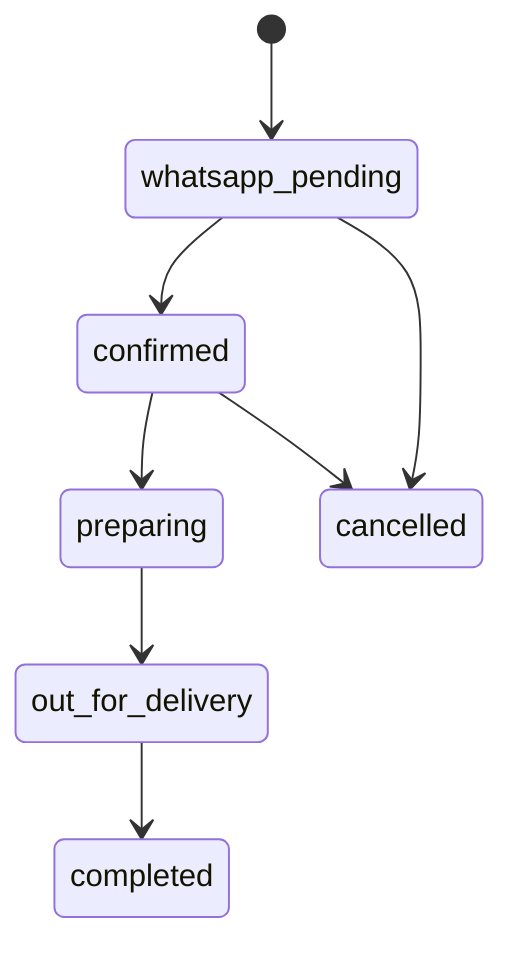

# Database Schema

The production database is Supabase Postgres. The executable schema lives in `supabase/schema.sql`.

## Tables

| Table | Purpose |
| --- | --- |
| `users` | Customer/admin profiles, phone numbers, roles, and loyalty points |
| `categories` | Menu categories such as Handi & Karahi, Burgers, Wraps, Deals |
| `menu_items` | Product catalog with price, photo, tags, spice level, prep time, availability, and popular badge |
| `delivery_areas` | Local delivery zones, fees, ETAs, minimum orders, and pickup option |
| `orders` | Checkout records with customer details, address, delivery area, totals, coupon, payment, and status |
| `order_items` | Line items attached to each order |
| `reviews` | Website, WhatsApp, Foodpanda, and Instagram testimonials with approval workflow |
| `coupons` | Repeat-order and opening-offer coupon rules |

## Order Status Flow

## Notes

- Public reads are allowed for active menu items, active delivery areas, approved reviews, and categories.
- Public inserts are allowed for orders, order items, and review submissions.
- Admin management should be protected with Supabase Auth before launch.
- Server API routes use the Supabase service role key when provided, otherwise the app falls back to demo in-memory data.
