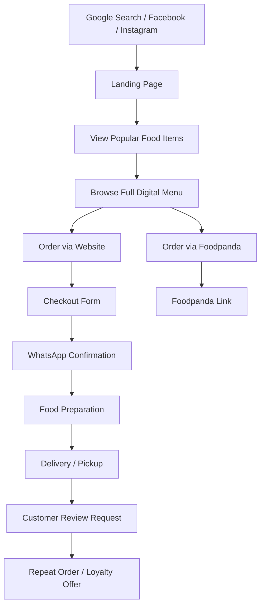

# User Flow

## Conversion Priorities

- Sticky mobile order button remains visible throughout the site.
- Native menu replaces PDF friction with search, filters, category chips, photos, and add-to-cart.
- Checkout captures name, phone, address, delivery area, notes, coupon, and payment method.
- WhatsApp confirmation bridges the trust gap for a home-based kitchen.
- Reviews and gallery proof reduce first-order anxiety.
- Coupons and loyalty points encourage repeat orders.
